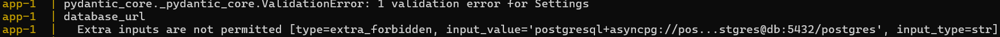
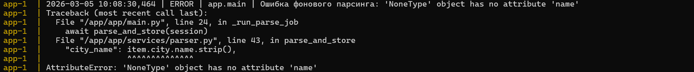
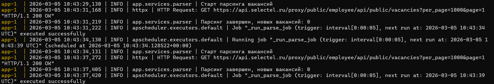
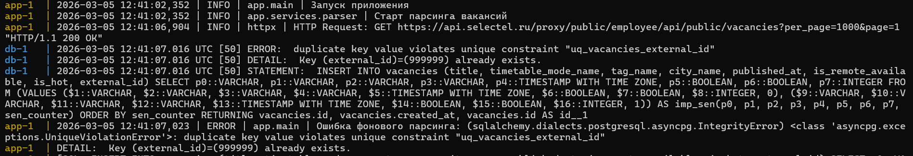
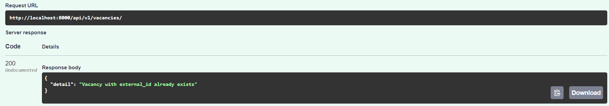
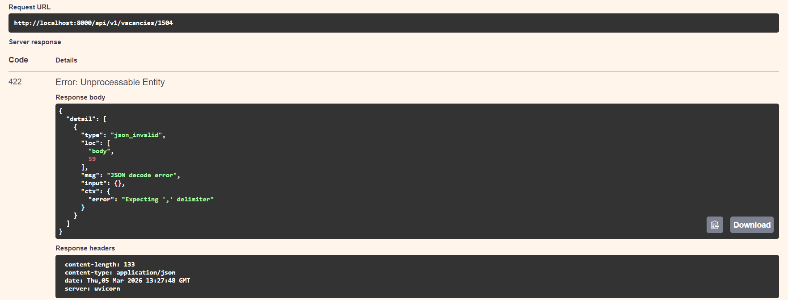
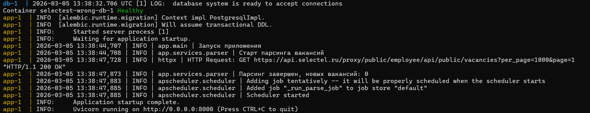
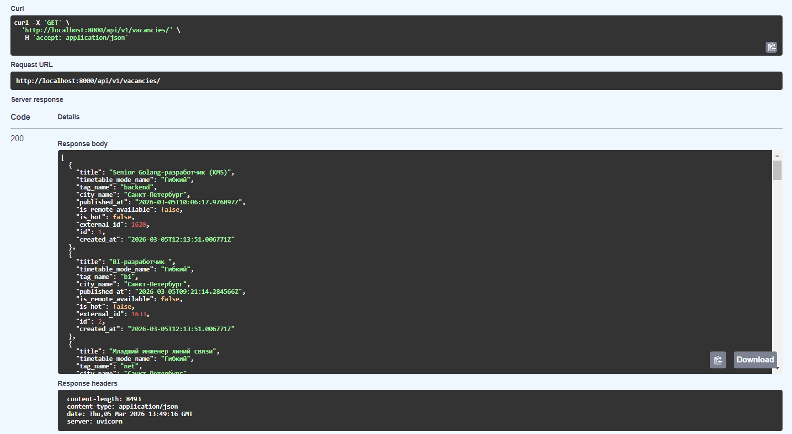
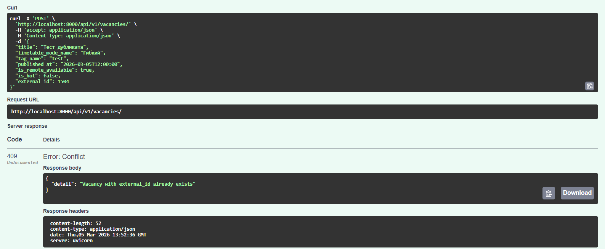
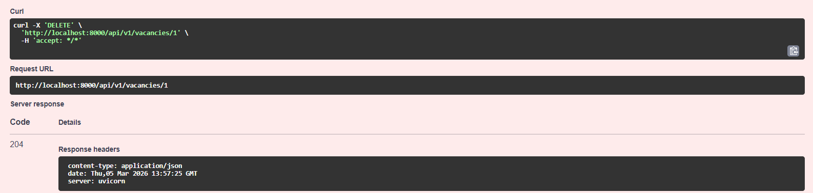

# Отчёт по отладке приложения

### Исмагилова Дина Маратовна

---

## Шаг 1. Инфраструктура и конфигурация
Анализ файлов, необходимых для успешной сборки и запуска Docker-контейнеров.

### 1. Ошибка в зависимостях
*   **Проблема:** В файле зависимостей была обнаружена невалидная строка.
*   **Источник:** `requirements.txt` 
    ```text
     fastapi==999.0.0; python_version < "3.8"
    ```
*   **Причина:** Несуществующая версия фреймворка и условие версии Python.
*   **Решение:** Удаление строки, так как fastapi уже указан в зависимостях.
    ```

### 2. Ошибка инициализации БД
*   **Проблема:** Приложение не могло подключиться к PostgreSQL. Переменная `DATABASE_URL` из `.env` файла игнорировалась, а дефолтное значение вело к несуществующей базе.

*   **Источник:** `app/core/config.py`
    ```python
    database_url: str = Field(
        "postgresql+asyncpg://postgres:postgres@db:5432/postgres_typo",
        validation_alias="DATABSE_URL",
    )
    ```
*   **Причина:** Опечатка в параметре `validation_alias`, из-за которой приложение пыталось подключиться к дефолтной, несуществующей базе `postgres_typo`.
*   **Решение:** 
    ```python
    database_url: str = Field(
        "postgresql+asyncpg://postgres:postgres@db:5432/postgres",
        validation_alias="DATABASE_URL",
    )
    ```

---

## Шаг 2. Отладка фоновых задач и работы с сетью

### 3. Ошибка парсинга при отсутствии города
*   **Проблема:** При обработке удаленных вакансий (где в example.json `city = null`) фоновая задача падала с ошибкой: `'NoneType' object has no attribute 'name'`.

*   **Источник:** `app/services/parser.py`
    ```python
    "city_name": item.city.name.strip(),
    ```
*   **Причина:** Отсутствие валидации на `None` перед обращением к вложенному атрибуту.
*   **Решение:** Добавлено безопасное извлечение значения:
    ```python
    "city_name": item.city.name.strip() if item.city else None,
    ```

### 4. Ошибочный интервал планировщика
*   **Проблема:** Парсинг запускался каждые 5 секунд вместо требуемых 5 минут. 

* **Источник:** `app/services/scheduler.py`
    ```python
    seconds=settings.parse_schedule_minutes,
    ```
*   **Причина:** В конфигурации `APScheduler` был неверно указан аргумент триггера.
*   **Решение:** 
    ```python
    minutes=settings.parse_schedule_minutes,
    ```

### 5. Утечка сетевых ресурсов
*   **Проблема:** HTTP-клиент для парсинга создавался, но сессия не закрывалась по завершении цикла.
*   **Источник:** `app/services/parser.py`
    ```python
    client = httpx.AsyncClient(timeout=timeout)
    ```
*   **Причина:** Отсутствие контекстного менеджера `async with` при работе с `httpx.AsyncClient`.
  *   **Решение:** Клиент обернут в контекстный менеджер для автоматического закрытия сокетов:
      ```python
      async with httpx.AsyncClient(timeout=timeout) as client:
      ```

---

## Шаг 3. Бизнес-логика, БД и CRUD API

### 6. Проблема N+1 запросов и риск IntegrityError
*   **Проблема:** В функции `upsert_external_vacancies` при обновлении вакансий выполнялся SQL-запрос `SELECT` внутри цикла `for` на каждую из сотен вакансий. А при получении двух новых вакансий с одинаковым `external_id` в одной пачке, скрипт падал бы с ошибкой уникальности при `commit()`.

*   **Источник:** `app/crud/vacancy.py`
    ```python
    if external_ids:
        existing_result = await session.execute(
            select(Vacancy.external_id).where(Vacancy.external_id.in_(external_ids))
        )
        existing_ids = set(existing_result.scalars().all())
    else:
        existing_ids = {}

    created_count = 0
    for payload in payloads:
        ext_id = payload["external_id"]
        if ext_id and ext_id in existing_ids:
            result = await session.execute(
                select(Vacancy).where(Vacancy.external_id == ext_id)
            )
            vacancy = result.scalar_one()
            for field, value in payload.items():
                setattr(vacancy, field, value)
        else:
            session.add(Vacancy(**payload))
            created_count += 1
    ```
*   **Причина:** Неэффективное использование ORM и необновляемый локальный кэш `existing_ids`. 
*   **Решение:** Выгрузка данных одним запросом и кэширование в словарь `vacancy_dict` `O(1)`. Добавлено обновление кэша на лету.
    ```python
    vacancy_dict = {}
    if external_ids:
        existing_result = await session.execute(
            select(Vacancy).where(Vacancy.external_id.in_(external_ids))
        )
        existing_vacancies = existing_result.scalars().all()
        vacancy_dict = {v.external_id: v for v in existing_vacancies}

    created_count = 0
    for payload in payloads:
        ext_id = payload["external_id"]
        if ext_id and ext_id in vacancy_dict:
            vacancy = vacancy_dict[ext_id]
            for field, value in payload.items():
                setattr(vacancy, field, value)
        else:
            session.add(Vacancy(**payload))
            if ext_id:
                vacancy_dict[ext_id] = Vacancy(**payload)
            created_count += 1
    ```

### 7. Нарушение REST-контракта при создании дубликата (POST)
*   **Проблема:** При попытке создать вакансию (`POST /vacancies/`) с уже существующим `external_id`, сервер возвращал статус `200 OK` и кастомный JSON.
  
* **Источник:** `app/api/v1/vacancies.py`
    ```python
    return JSONResponse(
        status_code=status.HTTP_200_OK,
        content={"detail": "Vacancy with external_id already exists"},
    )
    ```
*   **Решение:** Возврат изменен на стандартное исключение HTTP 409:
    ```python
    raise HTTPException(
        status_code=status.HTTP_409_CONFLICT,
        detail="Vacancy with external_id already exists",
    )
    ```

### 8.1 Отсутствие валидации уникальности при обновлении
*   **Проблема:** При обновлении вакансии сервер не проверял, занят ли новый `external_id` другой записью. При коллизии PostgreSQL выбрасывал `UniqueViolation`, а сервер падал с `500 Internal Server Error`.

*   **Источник:** `app/api/v1/vacancies.py`
*   **Решение:** В метод `update_vacancy_endpoint` добавлена проверка конфликта:
    ```python
    if payload.external_id is not None and payload.external_id != vacancy.external_id:
        existing = await get_vacancy_by_external_id(session, payload.external_id)
        if existing:
            raise HTTPException(status_code=status.HTTP_409_CONFLICT, detail="Conflict")
    ```

### 8.2 Отсутствие валидации лишних полей в запросах
*   **Проблема:** API принимал JSON-запросы с любыми дополнительными полями, которые не описаны в схеме.
*   **Источник:** `app/schemas/vacancy.py`
    ```python
    class VacancyBase(BaseModel):
        title: str
        timetable_mode_name: str
        tag_name: str
        city_name: Optional[str] = None
        published_at: datetime
        is_remote_available: bool
        is_hot: bool
        external_id: Optional[int] = None
    ```
*   **Причина:** По умолчанию Pydantic разрешает передачу любых дополнительных полей (`extra="ignore"`).
*   **Решение:** В базовую схему добавлена конфигурация, запрещающая передачу неописанных полей:
    ```python
    class VacancyBase(BaseModel):
        model_config = ConfigDict(extra="forbid")
        title: str
        timetable_mode_name: str
        tag_name: str
        city_name: Optional[str] = None
        published_at: datetime
        is_remote_available: bool
        is_hot: bool
        external_id: Optional[int] = None
        
    ```
---

## Шаг 4. Тестирование API

После внесения правок все критерии успешно выполненной работы были достигнуты.

**1. Успешный запуск контейнеров и выполнение фоновой задачи:**


**2. Корректная работа эндпоинтов чтения (GET /vacancies):**


**3. Корректная обработка конфликтов (POST /vacancies - 409 Conflict):**


**4. Обновление и Удаление (PUT / DELETE):**


**Итог:**
* ✅ Успешно собирается в Docker-образ
* ✅ Корректно подключается к PostgreSQL
* ✅ Фоновый парсинг вакансий работает с интервалом 5 минут
* ✅ Все эндпоинты API работают согласно REST-стандартам
* ✅ Нет утечек ресурсов (сетевые соединения, соединения с БД)
* ✅ Валидация входящих данных настроена корректно
* ✅ Код соответствует современным стандартам FastAPI